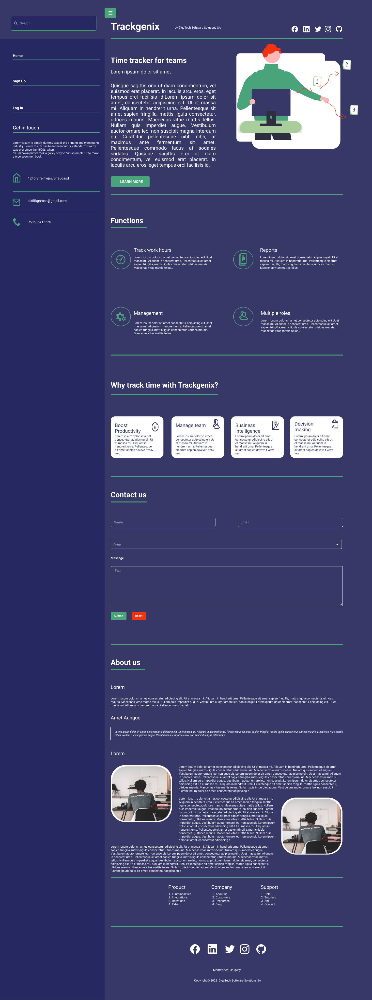

# TrackGenix

This project is about a web application named TrackGenix developed by 
Radium Rocket students.
Here is the landing page!
______________________________________

______________________________________
## Week 1

### What is it about?
It is a web application to facilitate the recording of hours worked by each employee in each project and work team.
This project is in full development. We started this project by doing the above landing page, and some more screens that are not yet available.

## Week 2

The Radium Rocket team started to develop the project,this week only the index.html was made, but as the weeks go by the project will grow!

### Need help?
*Contact us!*

### Contributing 

Pull request are welcome. For major changes, please open an issue first to discuss what you would like to change.

### License
[MIT](https://choosealicense.com/license/mit/)

